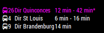

# BdxBus

Module dépendant [MagicMirror](https://github.com/MichMich/MagicMirror/) qui permet d'afficher les horraires des Bus de Bordeaux. Il vous faudra récupérer les lien des horaries des bus à partir de QR codes de chacunes des stations.

Ce module est basé sur celui de Otto Paulsen: https://github.com/ottopaulsen/MMM-NesteBussAtB

## Installation

Exécuter les commandes suivantes dans le répertoire`MagicMirror/modules` :

    git clone https://github.com/kuitin/MMM-BdxBus.git
    cd MMM-BdxBus
    npm install

## Configurations

Ajouter un nouveau module dans le fichier de configuration du MagicMirror (config/config.js):

    {
        module: 'MMM-BdxBus',
        position: 'bottom_left',
        config: {
                showIcon: true, // Affichage de l'icon de bus
                showNumber: true, // Affichage du numéro de bus
                showTo: true, // Affichage de la destination du Bus
                size: "small", // Taille du texte, par exemple small, medium ou large
                stopUrl: ["https://site.adtag.fr/adstudio/tbctempsreel/53c8dccae4b0fc835ee3c515/pages/home_bus.seam?ott=AAABa0YDbSUyTF"], // Url récupérée à partir du captcha à l'arrêt de bus.
                maxCount: 2, //Nombre max de bus par arrêt
                stacked: true, // Affichage de plusieurs bus qui ont la même destination et même arrêt
                colorDefault : "white",  
                colorByDst : [["Quinconces","#FF00FF"]]  
                }
    },
# MMM-BdxBus
